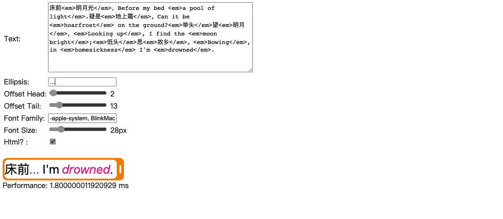

# Text Ellipsis

## 安装

```shell
npm install text-ellipsis2 --save
```

## 使用

```typescript
import textEllipsis from "text-ellipsis2";

const longText = `床前<em>明月光</em>，
Before my bed <em>a pool of light</em>.
疑是<em>地上霜</em>。
Can it be <em>hoarfrost</em> on the ground?
<em>举头</em>望<em>明月</em>，
<em>Looking up</em>, I find the <em>moon bright</em>;
<em>低头</em>思<em>故乡</em>。
<em>Bowing</em>, in <em>homesickness</em> I'm <em>drowned</em>.`.replace(/\n\s*/g,"");
const width = 250;
const offsets = [2, 13];
const ellipsis = "...";
const font = "28px -apple-system";
const isHtml = true;

const shortText = textEllipsis(longText, width, offsets, ellipsis, font, isHtml);
// 床前<em>...</em> I'm <em>drowned</em>.
```

[示例](./sample/index.html)


